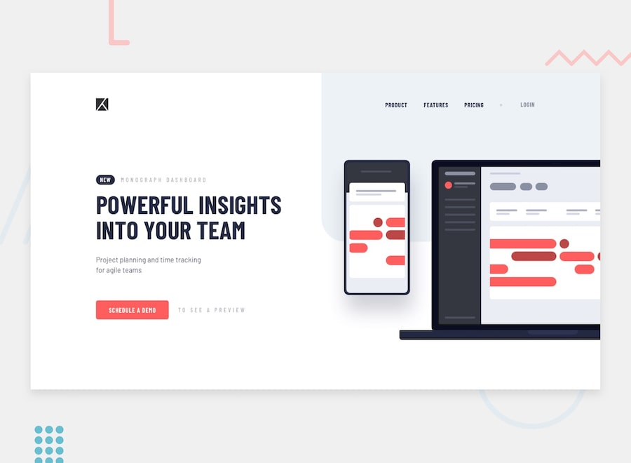
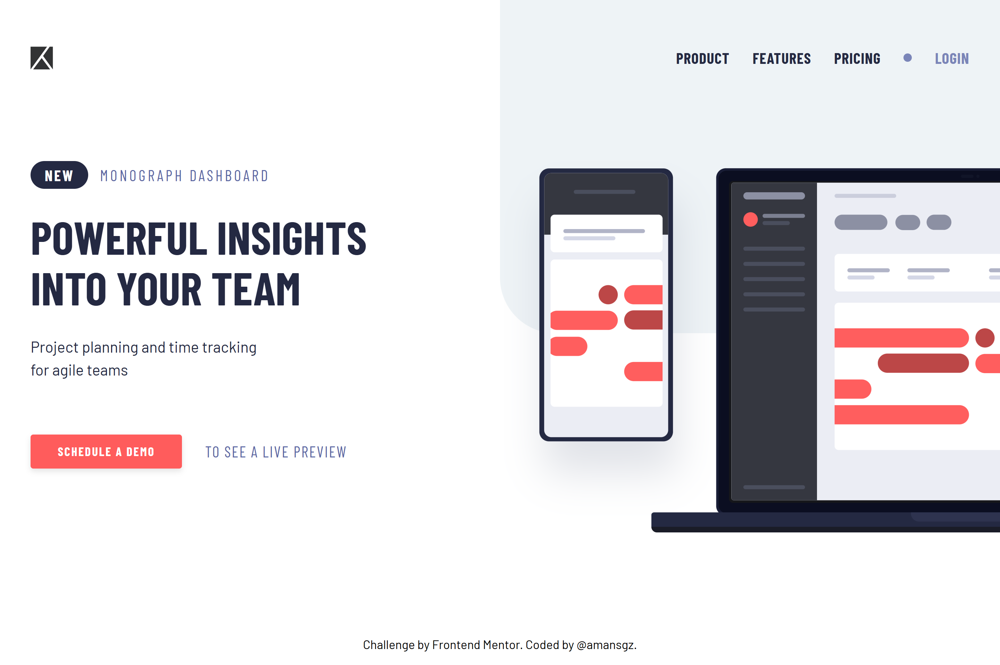
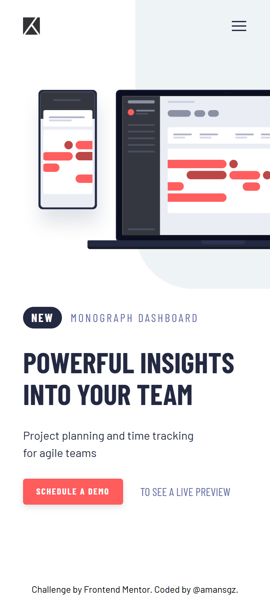

# Frontend Mentor - Project tracking intro component solution

This is a solution to the [Project tracking intro component challenge on Frontend Mentor](https://www.frontendmentor.io/challenges/project-tracking-intro-component-5d289097500fcb331a67d80e). Frontend Mentor challenges help you improve your coding skills by building realistic projects.

## Table of contents

- [Overview](#overview)
  - [The challenge](#the-challenge)
  - [Screenshots](#screenshots)
  - [Links](#links)
- [My process](#my-process)
  - [Built with](#built-with)
  - [What I learned](#what-i-learned)
  - [AI Collaboration](#ai-collaboration)
- [Author](#author)
- [Acknowledgments](#acknowledgments)

## Overview



### The challenge

Users should be able to:

- View the optimal layout for the site depending on their device's screen size
- See hover states for all interactive elements on the page
- Create the background shape using code

### Screenshots

<div style="border: 1px solid gray; margin-block-end: 2rem;">

</div>

<div style="border: 1px solid gray;">

</div>

### Links

- Solution URL: [https://www.frontendmentor.io/solutions/responsive-component-with-accessible-navigation-Gza8hgJff2](https://www.frontendmentor.io/solutions/responsive-component-with-accessible-navigation-Gza8hgJff2)
- Live Site URL: [https://amansgz.github.io/project-tracking-intro-component](https://amansgz.github.io/project-tracking-intro-component)

## My process

### Built with

- Semantic HTML5 markup
- BEM methodology
- CSS custom properties
- Flexbox
- Mobile-first workflow

### What I learned

#### Accessible Navigation Implementation

**Semantic HTML + ARIA Attributes**

I implemented an accessible navigation menu using semantic HTML enhanced with Aria atributes:

```html
<nav class="nav  header__nav" aria-label="Main navigation">
  <!-- Mobile hamburger button -->
  <button
    class="nav__toggle"
    type="button"
    aria-label="Toggle navigation menu"
    aria-expanded="false"
    aria-controls="main-menu"
  >
    

    
  </button>

  <!-- Menu Navigation -->
  <ul class="nav__list" id="main-menu">
    <li class="nav__item">
      <a class="nav__link" href="#">Product</a>
    </li>
    <li class="nav__item">
      <a class="nav__link" href="#">Features</a>
    </li>
    <li class="nav__item">
      <a class="nav__link" href="#">Pricing</a>
    </li>
    <li
      class="nav__item  nav__item--divider"
      aria-hidden="true"
      role="separator"
    ></li>
    <li class="nav__item">
      <a class="nav__link  nav__link--primary" href="#">Login</a>
    </li>
  </ul>
</nav>
```

**How `aria-expanded` works**

The `aria-expanded` attribute communicates the menu state to screen readers:

| State                   | Meaning        | Screen reader announcement |
| ----------------------- | -------------- | -------------------------- |
| `aria-expanded="false"` | Menu is closed | "Toggle menu, collapsed"   |
| `aria-expanded="true"`  | Menu is open   | "Toggle menu, expanded"    |

**JavaScript Implementation**

```js
navToggle.addEventListener("click", () => {
  const isExpanded = navToggle.getAttribute("aria-expanded") === "true";

  // Toggle the ARIA state
  navToggle.setAttribute("aria-expanded", !isExpanded);
});
```

```css
/* Toggle icons based on aria-expanded state */
.nav__toggle[aria-expanded="true"] .nav__toggle-icon--hamburger {
  opacity: 0;
  pointer-events: none;
}

.nav__toggle[aria-expanded="true"] .nav__toggle-icon--close {
  opacity: 1;
  pointer-events: auto;
}

/* Show menu when button has aria-expanded="true" */
.nav__toggle[aria-expanded="true"] + .nav__list {
  opacity: 1;
  visibility: visible;
}
```

### AI Collaboration

Throughout this project, I worked with **DeepSeek AI** who helped me:

**Writing better commits**

AI taught me to write conventional, descriptive commit messages that make the project history clear and meaningful.

**Debugging Accessibility Issues**

We went through each validator warning step by step:

- Why `role="list"` was redundant on `<ul>`
- How `position:fixed` can cut off content when zoomed
- When to use `px` vs `rem`

**Documentation Help**

For the README, DeepSeek:

- Created clear markdown tables for ARIA attributes
- Explained complex concepts simply

## Author

- Frontend Mentor - [@amansgz](https://www.frontendmentor.io/profile/amansgz)
- Github - [@amansgz](https://github.com/amansgz)

## Acknowledgments

- [Frontend Mentor](https://www.frontendmentor.io) for the challenge that started this project.
- [DeepSeek AI](https://www.deepseek.com/) for helped
  me to implement the Accessible Navigation.
